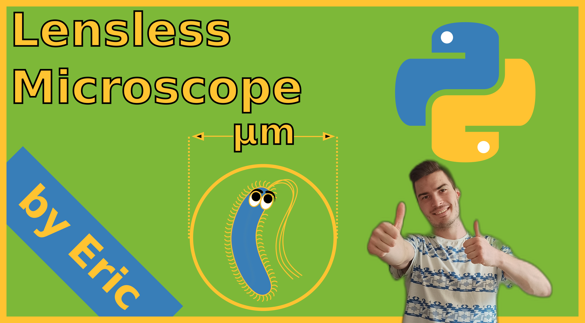
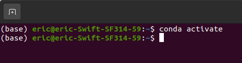

# Lensless-Microscope
This repository is created for the open source project of a lensless microscope, which I created for education in schools. Nevertheless the concepts can also be used in other projects.

Descriptive YouTube videos are available in this playlist (german language): [YouTube](https://youtu.be/6-eFapXcjyA)

If you want to support my work and help me to finance the next open source project, you can do this here: **no link yet**

## Getting Started
The recommended way of working with this repository is via the Anaconda or Miniconda. They can be installed via downloading on the webpage or with the terminal.

### Download miniconda 

You can download (in Windows: the .exe file of) [anaconda](https://www.anaconda.com/products/individual) or [miniconda](https://docs.conda.io/en/latest/miniconda.html) (miniconda is recommended, because it has fewer unnecessary packages) via these links.

With Linux, you can also download it in the terminal with the command:
```bash
wget https://repo.anaconda.com/miniconda/Miniconda3-latest-Linux-x86_64.sh
```
Then install by typing:
```bash
bash ./Miniconda3-latest-Linux-x86_64.sh
```
Follow the instructions and accept with yes and enter if you agree. Than restart the terminal.

### Activate the environment
To activate conda, you have to open the terminal and type in
```bash
conda activate
```
with linux it is already activated. It looks like the following than:




If you have problems with these steps, than check out Step 1 here: [conda environment](https://github.com/BiAPoL/Bio-image_Analysis_with_Python/blob/main/conda_basics/01_conda_environments.md) 

### Install packages
For our purpose, we only need a few packages, that's why we skip the powerfull tool of creating conda environments (if you are nevertheless interested in it, search for **conda create**). To install the packages we type into the opened terminal:
```bash
pip install opencv-python imageio
```
and hit enter afterward. This installs the libraries of **cv2** and **imageio**.


### Try it out
Create a new file with a texteditor of your choice (e.g. Geany or the standard text editor) and save the file as "test.py" in a folder of your choice. Write in this file: 
```bash
import cv2
import imageio
print("Hello World")
print(5 + 5)
```

#### Linux
Open the folder and make a right klick there. Click on "Open in terminal". Than the terminal, in which conda is already activated, appears. Type in:
```bash
python test.py
```
to run the python file. It should now output the lines: "Hello World" and the number 10. Also it should not give an error message for importing the modules cv2 and imageio.

#### Windows
Open the terminal and navigate to the folder of interest. For example if you saved your files in the microscope folder on your desktop C:Users/Eric/Desktop/microscope than type in the terminal:
```bash
cd "C:Users/Eric/Desktop/microscope"
```
Than the path should be correct. Type than, if not done yet,
```bash
conda activate
```
to activate the environment (in which cv2 and imageio are accessible)
Finally type in:
```bash
python test.py
```
to run the python file. It should now output the lines: "Hello World" and the number 10. Also it should not give an error message for importing the modules cv2 and imageio.


## Download repository and run files
To have access to all files in this repository locally (without internet connection), it make sense to download it. Unzip the file after downloading.
Inside this repository is the folder called: **PythonSkripte**, in which all python files are saved. To run the code of for example Tutorial 1, open the folder in the terminal, by typing

```bash
cd "C:Users/Eric/Downloads/"
cd Lensless-Microscope
cd PythonSkripte
cd 01_Videos_mit_Kamera
```
to navigate into the folder: "C:Users/Eric/Downloads/Lensless-Microscope/PythonSkripte/01_Videos_mit_Kamera"
Once you are there, activate your conda environment and type in:
```bash
python 01_Videos_mit_Kamera.py
```
This will lead to an error message, because you are not connected to a camera yet. 

## Connect to the USB camera
Unpack your USB camera and connect the camera via the USB port with your laptop/PC. Try to run the command from the command line again:
```bash
python 01_Videos_mit_Kamera.py
```

If the warning:
```
[ WARN:0] global /tmp/pip-req-build-driubr42/opencv/modules/videoio/src/cap_v4l.cpp (890) open VIDEOIO(V4L2:/dev/video2): can't open camera by index
Traceback (most recent call last):
  File "/home/eric/Desktop/Backup/Mikroskop/PythonSkripte/01_Videos_mit_Kamera/01_Videos_mit_Kamera.py", line 78, in <module>
    cv2.imshow("Image",img)
cv2.error: OpenCV(4.5.4) /tmp/pip-req-build-driubr42/opencv/modules/highgui/src/window.cpp:1006: error: (-215:Assertion failed) size.width>0 && size.height>0 in function 'imshow'
```
appears, with focus on **can't open camera by index** than open the file "01_Videos_mit_Kamera.py" and change in the line (approximately) 27 the number in the brackets. Go through all integers from 0 to ... and run in between always the code 
```bash
python 01_Videos_mit_Kamera.py
```
and see, which integer is the correct one. In normal case this should be either 0 for the inbuild camera, 1,2 or 3 for the USB ports. So if you pass, let's say 10 and nothing happend yet, than something went wrong. Eventually the camera is not plugged in correctly.


## author
```
Eric Schmidt
```


